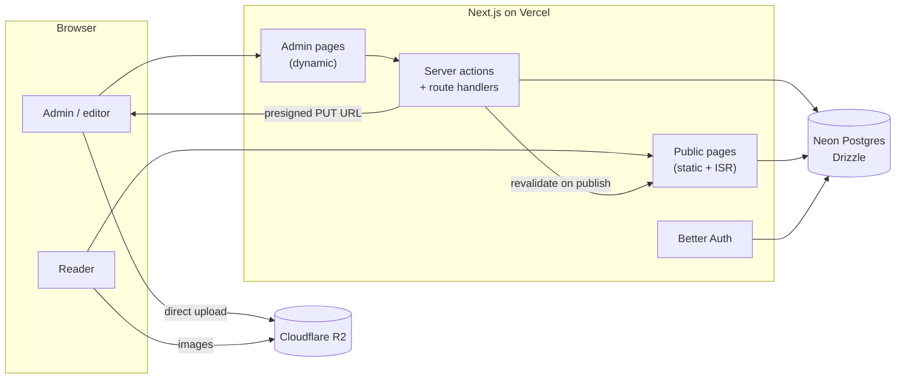

# Folio

[](https://github.com/vegaa055/CMS/actions/workflows/ci.yml)

A modern, general-purpose CMS: a fast public site for writing and a polished admin dashboard for
running it. Built with Next.js 16, Postgres, and a dark-first design system.

> **Folio** is a placeholder name. Admins can rename the site in **Settings**; the defaults live in
> [`src/config/site.ts`](src/config/site.ts).

## Features

**Writing**

- Rich-text editor (Tiptap) with headings, lists, quotes, code, links, and images
- Drafts autosave; published posts change only on an explicit **Update**
- Publish now, schedule for later, unpublish, archive; draft preview links
- Slugs, excerpts, tags (created inline), cover images, per-post SEO overrides

**Media**

- Drag-and-drop uploads straight from the browser to Cloudflare R2 (presigned URLs)
- Server re-verifies every upload's size and type before recording it
- Library with search, alt text, usage-aware deletion, and a picker in the editor

**Public site**

- Home, archives, post pages with prev/next and related posts, topics, author pages
- Postgres full-text search with ranked, highlighted results
- Generated Open Graph images, JSON-LD, sitemap, robots.txt, and a full-content RSS feed
- Static generation with incremental revalidation; dark and light themes

**Team**

- Roles: **admin**, **editor**, **author**, enforced on every page and server action
- Invite-only sign-up with one-time, hashed, expiring links
- Profiles with avatars and public author pages; editable site settings

**Quality**

- Unit, database integration, and Playwright end-to-end tests
- CI runs everything against a fresh, disposable Neon database branch per run
- Rate-limited auth, security headers, sanitized content, no unsafe HTML

## Tech stack

| Layer         | Choice                                                 |
| ------------- | ------------------------------------------------------ |
| Framework     | Next.js 16 (App Router, Server Actions, ISR), React 19 |
| Language      | TypeScript                                             |
| Styling / UI  | Tailwind CSS v4, shadcn/ui (Radix), next-themes        |
| Database      | Neon Postgres, Drizzle ORM (HTTP driver)               |
| Auth          | Better Auth (email/password, optional GitHub OAuth)    |
| Editor        | Tiptap 3 (stored as JSON, server-rendered)             |
| Media storage | Cloudflare R2 (S3-compatible, `aws4fetch`)             |
| Testing       | Vitest, Playwright                                     |
| Hosting / CI  | Vercel, GitHub Actions                                 |

## Architecture



- **Reads** on the public site are static pages, regenerated when content changes and every
  5 minutes (which is also how scheduled posts go live without a cron job).
- **Writes** go through server actions that re-authorize every call, validate with zod, and
  refresh the public cache.
- **Uploads** never pass through the app server: the browser PUTs to R2 with a short-lived
  signed URL, then the server checks what actually landed.

## Getting started

**Prerequisites:** Node 24+, a [Neon](https://neon.tech) Postgres database.

```bash
npm install
cp -n .env.example .env.local   # then fill in DATABASE_URL and BETTER_AUTH_SECRET
npm run db:migrate
npm run db:seed                 # optional demo content
npm run dev
```

Open http://localhost:3000/register. **The first account becomes the admin**; after that,
registration is closed and people join by invite. Media uses local disk storage until you
[configure R2](#media-storage).

## Scripts

| Script                               | Purpose                                                   |
| ------------------------------------ | --------------------------------------------------------- |
| `npm run dev` / `build` / `start`    | Develop, build, run production                            |
| `npm run lint` / `typecheck`         | ESLint; route types + `tsc`                               |
| `npm run format`                     | Prettier (with Tailwind class sorting)                    |
| `npm test`                           | Unit tests (Vitest)                                       |
| `npm run test:int`                   | Integration tests against the database in `.env.local`    |
| `npm run test:e2e`                   | Playwright end-to-end tests (reuses a running dev server) |
| `npm run screenshots`                | Regenerate README screenshots                             |
| `npm run db:generate` / `db:migrate` | Create / apply SQL migrations                             |
| `npm run db:seed` / `db:studio`      | Seed demo content / open Drizzle Studio                   |

## Testing

| Layer       | Tool       | What it covers                                                                                                              |
| ----------- | ---------- | --------------------------------------------------------------------------------------------------------------------------- |
| Unit        | Vitest     | Permissions, publishing rules, sanitizer, editor round-trip, helpers                                                        |
| Integration | Vitest     | Server actions and queries against real Postgres (posts, tags, media uploads, users, invites, settings, public read models) |
| End-to-end  | Playwright | Sign-in, writing and publishing a post, media upload, invite → sign-up → removal, public pages, headers                     |

Integration and e2e tests create their own `int-*` / `e2e-*` data and remove it afterwards, so
they can run against a development database.

**CI** ([`.github/workflows/ci.yml`](.github/workflows/ci.yml)) runs lint, types, formatting, and
unit tests on every push. When Neon is configured it also creates a database branch from an
empty `ci-base` branch, applies every migration from scratch, seeds, runs integration tests,
builds, runs e2e tests against `next start`, and deletes the branch. To enable it, add a
`NEON_API_KEY` repository secret and a `NEON_PROJECT_ID` repository variable.

## Deploying to Vercel

1. **Database** — apply migrations to your production branch (Neon `main`):
   `DATABASE_URL=<main connection string> npm run db:migrate`
2. **Media** — set up an R2 bucket (below) and add your production origin to its CORS policy.
3. **Vercel project** — import the repo and set these environment variables:

   | Variable                                                                                  | Value                                                         |
   | ----------------------------------------------------------------------------------------- | ------------------------------------------------------------- |
   | `DATABASE_URL`                                                                            | Neon `main` pooled connection string                          |
   | `BETTER_AUTH_SECRET`                                                                      | New random value: `openssl rand -base64 32`                   |
   | `NEXT_PUBLIC_APP_URL`                                                                     | Your production URL (optional; defaults to the Vercel domain) |
   | `STORAGE_DRIVER`                                                                          | `r2`                                                          |
   | `R2_ACCOUNT_ID`, `R2_ACCESS_KEY_ID`, `R2_SECRET_ACCESS_KEY`, `R2_BUCKET`, `R2_PUBLIC_URL` | From Cloudflare                                               |

   Preview deployments work without extra configuration (auth trusts the deployment URL); point
   their `DATABASE_URL` at a non-production branch.

4. **First admin** — visit `/register` on the new deployment and create your account.

## How it works

### Authentication and roles

- The **first account** to register becomes the admin. After that, registration is closed
  unless `AUTH_ALLOW_SIGNUP=true`; new people join through **invites** (Users → Invite user).
  Only a SHA-256 hash of the invite token is stored, and links expire after 7 days.
- Roles are checked in every page and server action (`requireSession()` /
  `requirePermission()`); `src/proxy.ts` is only an optimistic redirect for signed-out visitors.
  Permissions are defined in `src/lib/auth/permissions.ts`.
- Sessions aren't cached in cookies, so role changes and removals apply on the next request.
  You can't change your own role, and the last admin can't be demoted or removed.
- Sign-in, sign-up, and password changes are rate-limited in Postgres (serverless-safe).

### Content

- Posts are stored as ProseMirror JSON. On save the server validates the document against the
  editor schema and strips unsafe links and images; pages render it on the server with the same
  extensions, so no editor code ships to readers.
- Statuses: `draft` → `scheduled` / `published` → `archived`. Authors write drafts; editors and
  admins publish.

### Public site

| Route                                          | What                                  | Rendering            |
| ---------------------------------------------- | ------------------------------------- | -------------------- |
| `/`                                            | Featured post, recent writing, topics | Static, ISR 5 min    |
| `/posts`, `/posts/[slug]`                      | Archive and post pages                | Post pages SSG + ISR |
| `/tags`, `/tags/[slug]`, `/authors/[username]` | Topic and author archives             | ISR / dynamic        |
| `/search?q=`                                   | Full-text search                      | Dynamic              |
| `/feed.xml`, `/sitemap.xml`, `/robots.txt`     | Generated from live content           | Static               |

### Media storage

| `STORAGE_DRIVER` | Where files live                     | Use for                 |
| ---------------- | ------------------------------------ | ----------------------- |
| `local`          | `./.uploads`, served at `/uploads/…` | Local development only  |
| `r2`             | Cloudflare R2 bucket (public URL)    | Previews and production |

Accepted: JPEG, PNG, WebP, GIF, AVIF up to 10 MB (SVG is excluded because it can carry scripts).

**Setting up Cloudflare R2**

1. **Bucket** — Cloudflare dashboard → R2 → _Create bucket_ (e.g. `folio-media`).
2. **Public access** — bucket → _Settings_ → _Public access_: enable the `r2.dev` subdomain or
   connect a custom domain (recommended for production). Copy the URL.
3. **CORS** — bucket → _Settings_ → _CORS policy_:
   ```json
   [
     {
       "AllowedOrigins": ["http://localhost:3000", "https://your-domain.com"],
       "AllowedMethods": ["PUT", "GET", "HEAD"],
       "AllowedHeaders": ["content-type"],
       "MaxAgeSeconds": 3600
     }
   ]
   ```
4. **API token** — R2 → _Manage API tokens_ → _Create API token_ with **Object Read & Write**,
   scoped to the bucket.
5. **Configure** `STORAGE_DRIVER=r2` and the `R2_*` variables, then restart.

### Database

Schema lives in `src/db/schema/`; migrations in `drizzle/`. Neon branches: `main` (production),
`dev` (local development), and `ci-base` (an empty branch CI forks from).

## Design decisions

- **Drizzle over Prisma** — SQL-shaped queries, no engine binary, fast serverless cold starts.
- **Server Actions over a separate API** — one deployable; every action re-checks permissions.
- **Direct-to-storage uploads** — files never touch the app server; the server verifies after.
- **JSON content, server-rendered** — structured, sanitizable, and no editor JS for readers.
- **ISR + on-demand revalidation** — static-fast public pages that update on publish, and
  scheduled posts without a cron job.

---

The previous PHP version of this project is preserved at the `legacy-php` git tag.
